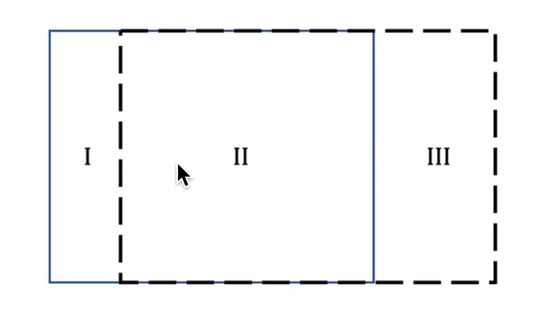

## 物质导数

在流体力学研究中，我们通常关心流体中的物理量（如密度 \( \rho \)、速度 \(\mathbf{v}\)、温度 \(T\) 等）
如何随时间和空间变化。为了描述**随流体运动的某一点**的性质变化，
我们引入**物质导数**（Material Derivative）。

物质导数是沟通拉格朗日法和欧拉法的核心公式。
拉格朗日法关注的是**随流线移动的流体微元内部的属性**。
欧拉法关注的是**三维空间中固定位置的微元内部的属性**。

物质导数是沿着流线的变化率（全导数）。

流线是关于时间的函数（关于时间的参数方程）。
\[\mathbf{x} = \mathbf{x}(t)\]

随着流线移动的微元的属性可以表示为
\[\rho = \rho(\mathbf{x}(t), t) \]

物质导数就是对随流线移动的流体微元的属性求时间的导数，
根据多元函数的微分法则可知。

\[
\frac{D \rho}{ D t} = 
\frac{\partial \rho}{\partial t} + 
\frac{\partial \rho}{\partial \mathbf{x}}
\frac{\partial \mathbf{x}}{\partial t} =
\frac{\partial \rho}{\partial t} + 
\mathbf{v} \cdot \frac{\partial \rho}{\partial \mathbf{x}}
\]

要理解该公式，首先要注意，
**随流线移动的流体微元** 是一个随时间移动的立方体
（一个纯粹的几何体，可以是其他形状的微元，但是必须是微分体积），
当时间固定时，**随流线移动的流体微元** 
会与 一个 **三维空间中固定位置的微元** 重合。

微元并不是包含流体的一个流体团（只是一个形状不变的几何体），因此，其体积内部并不是质量守恒的。
**随流线移动的流体微元** 内部的属性随时间的变化（比如密度）
包含两个部分，一部分是与当前**随流线移动的流体微元**重合的
**三维空间中固定位置的微元**的属性变化
（没有源汇的情况，微元表面的通量导致局部变化）。
另一部分是微元随着流线移动一小步（微元的位置会随时间变化）导致的变化。

\[ 
\frac{D \rho}{ D t} =
\frac{\rho_{t+\Delta t}^{trace} - \rho_{t}^{trace}}{\Delta t}
\]
其中，$\rho^{trace}$ 是指随流线移动的流体微元的密度
\[ 
  \frac{\partial \rho}{\partial t} = 
\frac{\rho_{t+\Delta t}^{local} - \rho_{t}^{local}}{\Delta t}
\]
其中，\(\rho^{local}\) 是三维空间中固定位置的微元的密度

注意，在 \(t\) 时刻，**随流线移动的流体微元**与**三维空间中固定位置的微元** 重合。
因此 \(\rho_{t}^{trace} = \rho_{t}^{local}\)
\[ 
\frac{D \rho}{ D t} - \frac{\partial \rho}{\partial t} = 
\frac{\rho_{t+\Delta t}^{trace} - \rho_{t+\Delta t}^{local}}{\Delta t}
\]

在 \(t+\Delta t\) 时刻，**随流线移动的流体微元**与**三维空间中固定位置的微元** 不重合。
存在偏移, 偏移量与流体微元在 \(t\) 到 \(t + \Delta t\) 时刻的速度相关

\[ 
\rho_{t+\Delta t}^{trace} - \rho_{t+\Delta t}^{local} = 
\frac{\int\limits_{t}^{t+\Delta t} v(t)\, dt}{\Delta x}
(\rho_{t+\Delta t}^{local+\Delta x} - \rho_{t+\Delta t}^{local})
\]

根据积分中值定理, 由于 \(\Delta t \to 0\)
\[
  \int\limits_{t}^{t+\Delta t} v(t)\, dt \approx v_t \Delta t
\]

因此
\[ 
\frac{\rho_{t+\Delta t}^{trace} - \rho_{t+\Delta t}^{local}}{\Delta t} = 
 v_t \frac{\rho_{t+\Delta t}^{local+\Delta x} - \rho_{t+\Delta t}^{local}}{\Delta x} =
 v_t \frac{\partial \rho}{\partial x}|_{t=t+\Delta t}
\]

可得
\[
  \frac{D \rho}{ D t} =
  \frac{\partial \rho}{\partial t} + 
  v_t \frac{\partial \rho}{\partial x}|_{t=t+\Delta t}
\]

根据泰勒展开，且 \(\Delta t \to 0\)，最后可得一维的情况
\[
  \frac{D \rho}{ D t} =
  \frac{\partial \rho}{\partial t} +
  v \frac{\partial \rho}{\partial x}
\]

### 物质导数的意义

可以根据物质导数定义一些特殊的流体，比如可以给出不可压缩流体的定义为
\[
  \frac{D \rho}{ D t} = 0
\]
如果是一维情况，不可压缩流体意味着流体本身运动与微元的运动是一致的。

根据连续性方程，
\[
  \frac{D \rho}{ D t} = - \rho \nabla \cdot \mathbf{v} = 0
\]

不可压缩流体并不意味着流体性质均一，因此 \(\rho \neq 0\)， 所以可得
\[
  \nabla \cdot \mathbf{v} = 0
\]

如果只看二维的情况
\[
  \nabla \cdot \mathbf{v} = 
  \frac{\partial u}{\partial x} + \frac{\partial v}{\partial y} = 0 
\]
也就意味着在 $x$ 方向的压缩，会导致在 $y$ 方向膨胀。

同时物质导数直观的反映了沿着流线的属性变化，
比如一根流线分别在三点和四点经过的苏州上海。
苏州三点温度为 20 度，上海四点维度为 21 度。
可以认为 20 度是温度平流， 
而多出来的 1 度是气团在流动过程中被加热了（热传导、做工、热辐射等）

