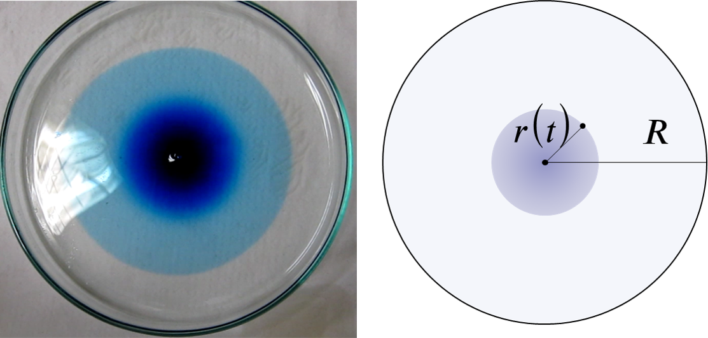
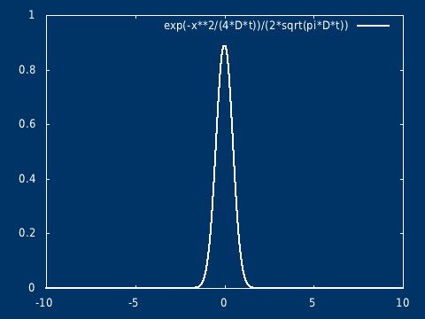
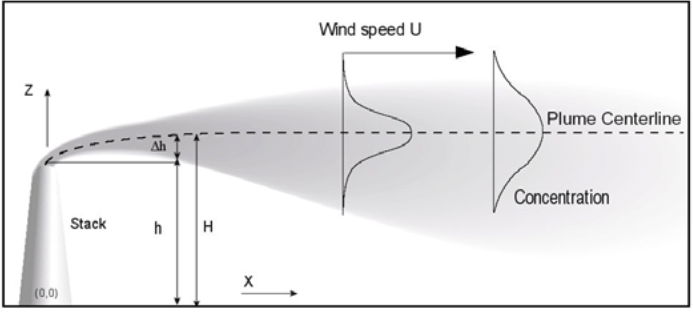
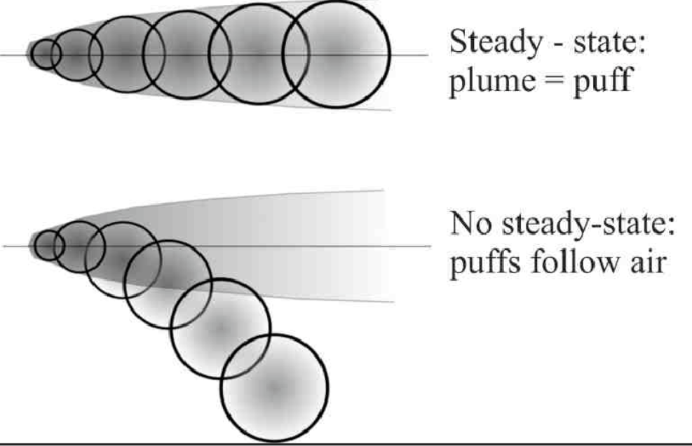

## 引子
对于流体，其分子不断做不规则的随机运动（热运动），由于分子间的频繁碰撞，这种运动表现出高度的随机性，导致两类宏观现象，对于单个较大的颗粒（如悬浮颗粒），受涨落影响（粒子足够小，不同时间被分子撞击的力并不相等，也就是受力的涨落），发生布朗运动；而对于大量的小分子群体（一滴墨水滴入水中），表现为扩散现象（我们没办法从视觉上看到单个分子的运动轨迹）。

在统计意义上，这些粒子（无论是大颗粒还是小分子）在流体中的随机位移，随着时间的推移，会受到微扰的累计影响。根据中心极限定理，大量独立、微小的随机扰动累加后的分布趋于高斯分布。

因此，它们的位置概率密度满足如下形式的高斯解：

\\[
   \rho(x, t) = \frac{1}{\sqrt{4\pi Dt}} e^{\frac{-x^2}{4Dt}}
\\]

我们观察点源的扩散现象，由于大量示踪分子的存在，使得我们能够明显从直觉上感知到高斯分布的存在。而布朗运动的轨迹可以被看作是从概率分布中采样得到的路径（就像量子波函数的坍塌），从一个连续的概率分布中，观测后得到一个确定的结果。

## 高斯扩散
设在无界空间中，污染物在某一点瞬时释放，总质量为 \\( Q \\) ，扩散过程（分子扩散）满足
\\[\frac{\partial C}{\partial t}  = D \nabla^2 C\\]
\\[C(0, x)  = Q\delta(0)\\]
- \\( \delta(0) \\) 表示初始时刻在原点释放污染物
- \\( D \\) 为扩散系数

该方程的解析解为:
\\[
C(t, x) = \frac{Q}{\sqrt{ 4\pi D t} } \exp( -\frac{ x^2}{4 D t} )
\\]
\\( t=0, x = 0\\)，浓度无限大，相当于是一个奇点（但是不发散），在初始时刻不再是经典意义下的函数，而是趋于 Dirac δ 函数（高斯分布在标准差趋于 0 的极限下，会趋于 Dirac δ 函数，即 δ 函数是高斯分布族在某种极限意义下的结果）

可以很容易推广到二维（以及三维）。其物理意义，可以想象是在静止的水面（水很浅），点入一滴墨水，墨水向四周扩散，墨水滴入的地方是高值中心，随着时间的推移浓度的分布越来越平坦。

## 高斯烟羽模型
在大气中，污染物的支配方程为
\\[
\frac{\partial C_i}{\partial t}  = - \nabla \cdot \vec{v} C_i + E_i + P_i - S_i
\\]

- \\(C_i\\) 为某个污染物的浓度
- \\(E_i\\) 为某个污染物的排放
- \\(P_i\\) 为某个污染物的化学作用
- \\(S_i\\) 为某个污染物的沉降作用

假设稳态、连续恒定点源、恒定风速，同时扩散采用 \\( K \\) 理论（不考虑风速，依旧是对流，就是高斯扩散，是高斯烟羽的一个特殊情况）。

- 稳态：\\(\frac{\partial C_i}{\partial t}\\) = 0
- 恒定风速：\\( u \\) 不随时空变化
- \\( K \\) 理论（类似热传导），扩散系数固定 \\( K_x \\), \\( K_y \\) , \\( K_z \\) 

以 \\( u \\) 的方向为 \\( x \\) 方向

忽略化学和沉降，只考虑一个污染物，忽略 \\( x \\) 方向的扩散，可以得到
\\[
u \frac{\partial C}{\partial x} = 
  K_y \frac{\partial^2 C}{\partial y} + K_z \frac{\partial^2 C}{\partial z} + E_i
\\]

假设点源位于 \\((0, 0, H)\\) ，排放速率为 \\( Q \\)（单位：g/s）。

点源可表示为三维 Dirac δ 函数：
\\[
E_i(x, y, z) = \frac{Q}{u}\delta(x)\delta(y)\delta(z-H) = 
\frac{Q}{u}\delta(x)\delta(y)\delta(z-H)
\\]

最终的方程为
\\[
u \frac{\partial C}{\partial x} = 
  K_y \frac{\partial^2 C}{\partial y} +
 K_z \frac{\partial^2 C}{\partial z} +
 \frac{Q}{u}\delta(x)\delta(y)\delta(z-H)
\\]

该偏微分方程有解析解，采用**格林函数法**直接构造基本解。
\\[
u \frac{\partial G}{\partial x} = 
  K_y \frac{\partial^2 G}{\partial y} +
  K_z \frac{\partial^2 G}{\partial z} +
  \delta(x)\delta(y)\delta(z-H)
\\]

单位点源引起的浓度分布就是格林函数。

通过引入**等效时间变量** \\(\tau = \frac{x}{u}\\), 可以得到标准的**二维扩散方程**（\\(\tau\\) 理解为时间）。

\\[
 \frac{\partial G}{\partial \tau} = 
  K_y \frac{\partial^2 G}{\partial y} +
  K_z \frac{\partial^2 G}{\partial z} +
  \frac{1}{u}\delta(\tau)\delta(y)\delta(z-H)
\\]

\\[
 \frac{\partial G}{\partial \tau} - 
  K_y \frac{\partial^2 G}{\partial y} -
 K_z \frac{\partial^2 G}{\partial z} =
 \frac{1}{u}\delta(\tau)\delta(y)\delta(z-H)
\\]

等式右边为排放强迫，\\(\tau\\) 理解为时间时，相当于在初始时刻瞬时释放了一定质量的污染物

初始条件为（在初始点为的浓度会无穷大，但是质量是守恒的）：
\\[ G(\tau=0, y, z) = \frac{1}{u}\delta(\tau)\delta(y)\delta(z-H) \\]

为了约束格林函数解，根据物理意义，在无穷远处，浓度应当为 0（边界条件）.

可以直接写出格林函数解:

\\[
G(x, y, z) = \frac{1}{4\pi \frac{x}{u} \sqrt{K_y K_z} }
\exp( -\frac{u y^2}{4 K_y x} - 
\frac{u(z - H)^2}{4 K_z x})
\\]

这就是瞬时点源在二维空间扩散方程下的解析解！

恢复尺度（乘上 \\( Q \\) ）
\\[
C(x, y, z) = \frac{Q}{4\pi \frac{x}{u} \sqrt{K_y K_z} }
\exp( -\frac{u y^2}{4 K_y x} - 
\frac{u(z - H)^2}{4 K_z x} )
\\]

由于地面 （ \\( z= 0 \\) ）不可渗透（反弹），需满足边界条件：
\\[
\frac{\partial C}{\partial z}|_{z=0} = 0
\\]

\\[
C(x, y, z) = \frac{Q}{4\pi \frac{x}{u} \sqrt{K_y K_z} }
\exp( -\frac{u y^2}{4 K_y x} - \frac{u(z - H)^2}{4 K_z x} )
\exp( -\frac{u y^2}{4 K_y x} - \frac{u(z + H)^2}{4 K_z x} )
\\]

定义扩散尺度
\\[
\sigma_y^2 = 2 K_y \frac{x}{u}
\\]

\\[
\sigma_z^2 = 2 K_z \frac{x}{u}
\\]

最终可以得到高斯扩散模型解的一般形式。
\\[
C(x, y, z) = \frac{Q}{2\pi u \sigma_y(x) \sigma_z(x)} 
\exp\left( -\frac{y^2}{2\sigma_y(x)^2} \right) 
\left[ 
 \exp\left( -\frac{(z - H)^2}{2\sigma_z(x)^2} \right) +
 \exp\left( -\frac{(z + H)^2}{2\sigma_z(x)^2} \right) 
\right]
\\]

- \\( C(x, y, z) \\)：污染物浓度（单位：g/m³）
- \\( Q \\)：排放源的强度（g/s）
- \\( u \\)：风速（m/s），假设为恒定
- \\( \sigma_y(x), \sigma_z(x) \\)：在 \\(x\\) 方向上，横向（\\(y\\)）和垂直（\\(z\\)）的扩散系数，通常经验公式给出
- \\( H \\)：污染源的有效排放高度（m）
- \\(\exp\left( -\frac{y^2}{2\sigma_y^2} \right)\\) 表示污染物在横向（\\(y\\)）的**高斯分布**
- \\(\exp\left( -\frac{(z - H)^2}{2\sigma_z^2} \right)\\) 表示主烟团的垂直分布
- \\(\exp\left( -\frac{(z + H)^2}{2\sigma_z^2} \right)\\) 表示**地面反射项**（假设地面对污染物全反射）

## 高斯烟团模型
烟团模型将连续的烟羽离散化，并计算离散时刻的烟团的浓度，然后允许烟团移动，其大小、强度等发生变化，直到下一个采样步骤，而受体处的总浓度是所有烟团贡献的总和。

\\[
C(x, y, z, t) = \frac{Q}{(2\pi)^{3/2} \sigma_x \sigma_y \sigma_z} 
\exp\left( -\frac{(x-x_0(t))^2}{2\sigma_x^2} \right) 
\exp\left( -\frac{(y-y_0(t))^2}{2\sigma_y^2} \right) 
\exp\left( -\frac{(z-z_0(t))^2}{2\sigma_z^2} \right) 
\\]

相当于一个高斯扩散随着风场飘动。

若每隔 1 秒释放一个 puff，则总体浓度每个puff的叠加。

烟团法的一个传统缺点是需要释放大量烟团才能充分代表靠近源头的连续烟羽，如果烟团之间的距离最大超过 2σ，则可能会得到不准确的结果，同时烟团间隔减小到不超过 1σ，则可以获得更好的结果（烟团之间没有充分重叠）。

在风向变化时，一个已经释放的 Gaussian puff 的浓度分布并不会只是简单地“转弯”，如果风向持续改变，分布不再是各向同性的高斯，浓度分布会 拉长成“弯曲”路径，原本对称的高斯轮廓会变成 非轴对称形状，出现“剪切”或“拉扯”效应；因此需要 协方差矩阵 表示扩散形状。

\\[
C_i(\mathbf{r}, t) = \frac{Q}{(2 \pi)^{3/2} \sqrt{\det \Sigma_i(t)}} \exp \left( -\frac{1}{2} (\mathbf{r} - \mathbf{r}_i(t))^T \Sigma_i^{-1}(t) (\mathbf{r} - \mathbf{r}_i(t)) \right)
\\]
其中
- 第 \\( i \\) 个羽流在时间 \\( t \\) 时的位置为：\\(\mathbf{r}_i = (x_i, y_i, z_i)\\)
- 烟团扩散的协方差矩阵（初始协方差矩阵）为：
\\[
\Sigma_i = \begin{bmatrix}
\sigma_x^2 & 0 & 0 \\\\
0 & \sigma_y^2 & 0 \\\\
0 & 0 & \sigma_z^2
\end{bmatrix}
\\]

- 协方差矩阵随扩散增长，更新公式为：
\\[
\Sigma_i(t + \Delta t) = \Sigma_i(t) + D_{3D}
\\]

- 原始水平扩散矩阵：
\\[
D_{2D} = \begin{bmatrix}
2 K_x \Delta t & 0 \\\\
0 & 2 K_y \Delta t
\end{bmatrix}
\\]

- 旋转矩阵(旋转角度)：
\\[
R = \begin{bmatrix}
\cos \theta & -\sin \theta \\\\
\sin \theta & \cos \theta
\end{bmatrix}
\\]

- 旋转后扩散矩阵：
\\[
D_{2D}^{rot} = R D_{2D} R^T
\\]

- 嵌入三维扩散矩阵中：
\\[
D_{3D} = \begin{bmatrix}
D_{2D}^{rot} & 0 \\\\
0 & 2 K_z \Delta t
\end{bmatrix}
\\]

考虑烟团中心位置的变化，设当前风速为 \\( u \\)，风向为 \\( \theta \\) （不考虑垂直运动）。
\\[ \hat v = 
\begin{bmatrix}
\cos \theta_{rad} \\\\
\sin \theta_{rad} \\\\
0
\end{bmatrix}
\\]

\\[
\mathbf{r}_i(t + \Delta t) = \mathbf{r}_i(t) + \Delta t \cdot u \hat v
\\]

在任意时间 \\( t \\)，所有羽流的浓度叠加为：

\\[
C(\mathbf{r}, t) = \sum_i C_i(\mathbf{r}, t)
\\]
