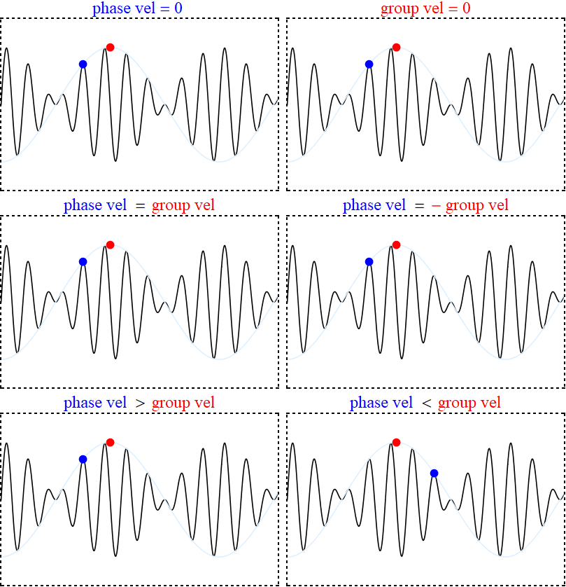

## 量子力学

量子力学有三种等价的形式
 1. 波动力学；
 2. 矩阵力学；
 3. 路径积分；

### 波函数
为什么光有波粒二象性（德布罗意波）？
\[
  E = \hbar w \\\\
  \vec{p} = \hbar \vec{k}
\]

对于的德布罗意波
\[
  E = \hbar w = \frac{(\hbar \vec{k})^2}{2m} \\\\
  w = \frac{\hbar k^2}{2m}
\]

群速度（波包或群体能量的传播速度）
\[
    v_g = \frac{dw}{dk} = \frac{p}{m}= v
\]

相速度（等相面移动的速度）
\[
    v_g = \frac{w}{k} = \frac{E}{p} = \frac{v}{2}
\]

波函数（平面波）的统计解释: 

什么是波？
 - 描述扰动（波动量、物理量）如何在介质中传播。
 - 宏观解释：波是由粒子组成的，大量粒子在震动，震动会影响旁边的粒子，导致震动能的传播；
 - 波的传播需要介质；
 - 但是观测表明，单个粒子的运动也有波动性（没有粒子间的相互作用）；
 - 干涉、衍射 \( \ne \) 波；
 - 波不是大量粒子运动的表现，粒子是由波组成的（波的叠加，波包就是粒子），也不行！

什么是粒子？
 - 颗粒性，弹性球（密度不重要），为什么是一个球（没道理）
 - 轨道可以预测：\( \vec(r) = \vec{r} (t) \)

什么是波动性？
 - 物理量（电源？）周期分布；
 - 干涉、叠加、衍射

怎么调和？ 
 - 概率波，将粒子的分布看作物理量；
 - 不要粒子的轨道；

波函数的统计解释：在 t 时候，粒子出现在 r 的概率（没有归一为粒子数）
\(\Psi(\vec{r}, t) = A e^{i(\vec{p} \cdot \vec{r} - Ew)/\hbar}\)

粒子的状态： 速度、动量、能量
通过位置的概率，去描述物质的速度、动量、能量的权重平均（期望）；

- 波函数 必须平方可积。如果粒子守恒，那就与 \(t\) 无关
\[
  \int \lvert \Psi(\vec{r}, t) \rvert^2 d\vec{r} = 1
\]
- 求模，
- 波函数本身是有界、连续的（个别的奇点不影响，从测度上讲，无所谓）
- 给了波函数，就能决定物质的状态

### 动力方程
波动力学： 波函数 和 薛定谔方程

\[
 i \hbar \frac{\partial \Psi(\vec{r}, t) }{\partial t} = 
 -\frac{\hbar^2}{2m} \nabla^2 \Psi(\vec{r}, t) + V(\vec{r}, t) \Psi(\vec{r}, r)
\]
