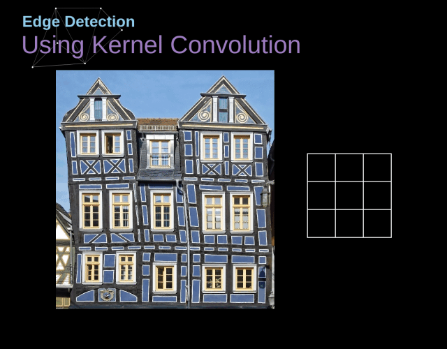

# 卷积神经网络

对于尺寸较小图像进行简单的分类处理时，传统神经网络架构已基本足够，将每个像素亮度视为一个独立特征，并直接作为全连接网络的输入即可。但当处理分辨率较高的图像（如现代手机常见的百万像素级图像）时，网络规模将急剧膨胀，第一层全连接神经元可能多达数千万甚至上亿个。虽然可以通过图像模糊或降采样来降低计算负担，但这往往伴随着关键信息的损失。

有没有办法在尽可能保留图像信息的同时，减少计算量与模型参数？卷积神经网络（Convolutional Neural Network, CNN）正是为解决这一问题而设计的。

**局部视野**和**权重复用**是卷积神经网络设计核心思想。卷积神经网络（CNN）在结构上可以构建出庞大的拓扑网络，同时其待训练的实际参数数量仍可保持在相对较低的水平。

我们以一维音频数据为例来说明卷积神经网络的构造过程（该方法易于推广至高维数据）。
假设我们的目标是将音频转化为文字，最直接的做法是将音频序列作为输入，全部连接至一个全连接层进行处理。全连接层由多个神经元组成（此处简化为单一节点 F ），每个神经元与输入序列中的所有数据点相连。

音频数据通常具有明显的局部性特征（图像数据亦然）。以“你好”为例，其对应的音频信号主要由与该词相关的局部时间片段决定，与前后语句的关联较弱。换言之，即使仅观察包含“你好”的局部音频片段，也能够准确识别其含义，且这一识别过程与该片段在整体音频序列中的具体位置无关。

因此，我们可以构建一组神经元 𝐴（在本文中定义为卷积神经元，包含多个卷积核，卷积核可视为一种滤波器，每个卷积核都可以用来匹配某种数据结构），**用于局部处理输入数据的某一小段**。并且，同一个**卷积神经元 A** 可重复应用于整个输入序列的不同位置，所有 A 共享相同的参数（卷积核），都命名成 A 就是表明，虽然卷积神经元 出现在卷积层的不同地方，但是参数是一样的（注意与全连接层对比理解，全连接层同一层的神经元的参数是不一样的！）。

为什么能够复用？音频中的数据有某种**平移不变性**，比如一段音频中任意位置中关于 "你" 的数据都应该具有相似性，这和它出现的位置无关，与前后的发音无关。那么同一个卷积核，应该能识别不同位置的相似性的音频。

如果我们接受了这个设定，那么卷积神经元中的卷积核宽度（即感受野的大小）应该设为多少呢？直观上，它应当足以覆盖一个最小的语音识别单元，例如一个汉字的发音长度。然而，由于语速可能因人而异、语境不同而变化，同一个字在不同语境下持续时间可能会有较大差异，这就带来了设计上的挑战。

另一个问题是，卷积核数量应该设为多少（通道数）？是否应为每种可能的发音分配一个卷积核？举例来说，如果我们希望系统能够区分约 5000 个不同汉字的发音，是否意味着需要设计 5000 个不同的卷积核？

思考这些问题，可以帮助我们从直觉上理解 CNN，但实际情况可能不是这样的，比如识别的可能只是拼音字母的发音，或者一些不能用人的思维理解的结构。

经过卷积操作后每个**卷积神经元 A**可以输出多个值（注意一个卷积核一个值），单一卷积核的所有输出融合在一起是某种特征映射，特征映射可以用向量空间的投影来理解，相当于是原来数据的某个方向的投影，不同的卷积核就是不同的基向量。

如果我们卷积神经元包含 10 个卷积核，那么就能提取 10 个不同的特征映射。

我们在构造 CNN 时， 卷积层也可以叠加。你可以将一个卷积层的输出输入到另一个卷积层。通过每一层，网络都可以检测更高级别、更抽象的特征（可以理解为把一个个字，变成词，再变成短语）。

下层的多个卷积核会对上层多个卷积核的输出进行分别卷积，通常每个卷积核只会保留一个输出，最简单的操作就是平均。

原始数据经过带有多个卷积核的卷积层处理后，通常会生成比原始输入更庞大的特征表示。若直接将这些特征传递至全连接层，参数数量将显著增加，违背了我们初衷中压缩参数的目标。为此，引入 **池化层**（Pooling Layer）对数据进行下采样和压缩，是常见且有效的做法。

卷积层与池化层通常交替堆叠使用。池化的核心思想是：从局部区域中提取代表性信息，同时减小特征图尺寸，降低后续计算成本。更重要的是，从任务角度看，我们通常并不关心某一特征精确出现的时间（或位置），只关心它是否出现过。这使得池化在实际应用中非常合理。

以最大池化（Max Pooling）为例，它在上一层特征图的局部区域内选取最大值，作为该区域的代表。这一操作本质上回答了一个问题：“该区域中是否出现过某个重要特征？例如，一个汉字的发音特征可能在多个相邻位置被卷积核激活，其中多数是冗余甚至是噪声，通过最大池化可以提取出最强响应，

卷积层结构非常容易从一维数据推广到高维数据。卷积神经网络最具代表性的成功案例之一正是在图像识别领域的广泛应用。

在二维卷积层中，卷积神经元 𝐴 不再是沿一维序列滑动、查看片段，而是沿二维图像扫描**局部区域块**。对于每一个图像块，卷积神经元会提取其中的局部特征，比识别如边缘（如水平/垂直边）、纹理结构（如重复图案）、颜色变化或局部形状模式等低层视觉特征。

我们也可以在二维空间中进行最大池化。归根结底，当我们考虑整幅图像时，我们不必关心边缘的精确位置，精确到像素。只要知道边缘在几个像素以内的位置就足够了（当然可以推广到三维的情况）。

二维卷积层（池化层同理）的输出通常是二维特征图；若使用多个卷积核，其输出将成为一个三维张量（高 × 宽 × 通道数）。而全连接层的输入要求是一维向量，因此在进入全连接层前，需要通过**扁平化层**（Flatten Layer）将三维数组转换为一维向量。

例如，大小为 5×5×2 的数组会被转换为一个长度为 50 的向量。此前的卷积与池化层负责从输入图像中提取局部与全局特征，而全连接层则负责对这些特征进行整合与最终分类。

在分类任务中，输出层通常采用 Softmax 函数，将网络输出映射为一个概率分布，用于表示输入图像属于各个类别的可能性。由于 Softmax 的输入为一维向量，因此扁平化操作是卷积网络连接至全连接分类层的关键步骤。

## 卷积数学的描述

卷积的数学定义是

\\[ f*g(c) = \sum_{a}(f(a) \cdot f(c-a)) \\]

用概率的方式去理解比较容易，两个骰子和的概率，就是典型的卷积过程。
当然，\\( a, b, c \\) 也可以是向量，这样很容易延展到高维。

我们可以将图像视为一个二维的离散函数，每个像素对应函数在某个点的取值；而卷积核则可看作另一个函数，其值集中在较小的局部区域（其实图片也是一样的，只是稍微大点）。在卷积神经网络（CNN）中，所谓“卷积”操作，本质上是输入图像与卷积核之间的二维离散卷积。该运算通过滑动卷积核窗口，对图像的局部区域进行加权求和，从而提取出局部特征信息。

在对图片进行卷积时存在定义域问题（图片外的离散个点是否应该有意），一种常见做法是将图像边界以外的区域视为零，这种填充方式称为 零填充（zero padding）。当使用足够的填充，使得卷积输出尺寸大于或等于原图像尺寸时，该操作在数学上对应于所谓的 full convolution（全卷积）。

注意我们用离散的坐标，来描述图片的卷积过程。

原来的图片 
\\[ P(i, j) = p_{i, j}  \qquad  N \ge i \ge 0, M \ge j \ge 0\\]

卷积核，注意 i 和 j 只在很小的范围（比如 k=3）
\\[ H(i, j) = w_{i, j}  \qquad  k \ge i \ge 0, k \ge j \ge 0 \\]

其中 \\( w = \\{ w_{i, j} \\} \\) 就是卷积核的权重系数。

卷积之后的二维数据为

\\[ G(n, m) = P * H (n, m) \sum_{i, j} P(i, j) \cdot H(n-i, m-j) \\]

上图展示的就不是全卷积，我们每次卷积之后，数组变小了（图片的定义域限制了卷积后的坐标值）。

在实际的卷积神经网络中，卷积神经元是具有多个卷积核，也就是说有多个 \\( w^k \\)，每个权重系数组\\( w^k \\)，可以理解为一种滤波器。

我们可以人工设计一些卷积核（赋予一些有意义的权重），比如用卷积核寻找边缘
，来看看在整张图上执行卷积运算之后得到的结果：

### 反向传播

对于一个卷积核，其权重的更新是，该卷积核的输入 与 下一层反向传播回来的误差函数的梯度的卷积（卷积核就是这个误差函数梯度矩阵）。

\\[ \frac{\partial G^l}{\partial W^l} = CONV \\:(y^{l-1}, \frac{\partial C}{\partial G^l})\\]

而需要传递到上一层的误差函数梯度，可以表示 为 180 度旋转（先垂直翻转，再水平翻转）的卷积核权重，与下一层反向传播回来的误差函数的梯度的卷积。

\\[ \frac{\partial C}{\partial y^{l-1}} =  Full \\; CONV \\:(180^o 旋转 W^l, \frac{\partial C}{\partial G^l}) \\]

