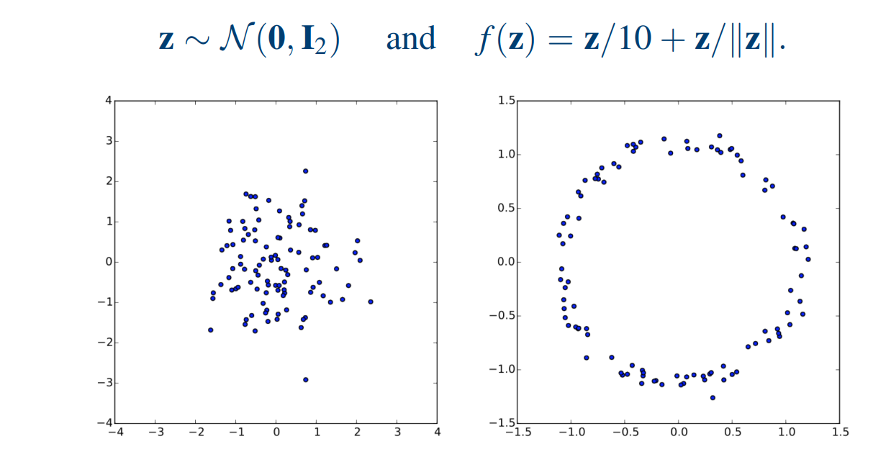
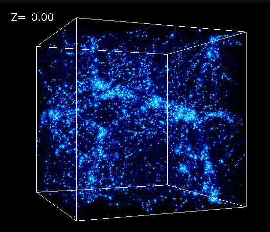
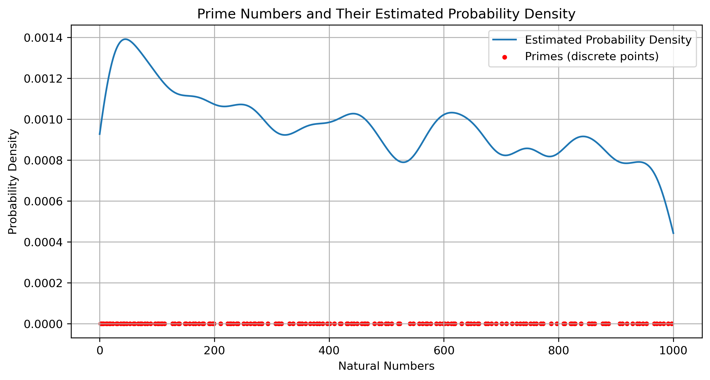

# 扩散模型

## 从自编码开始

**降维**可以看作是一种有损压缩（特殊情况下也可以是无损的）。当我们希望减小图片大小时，就可以采用降维技术。

例如，一些线性变换技术（如傅里叶变换、小波变换），本质上就是对数据进行换基操作。通过将数据表示在一组新的标准正交坐标系下，可以使得信息更加集中于少量的维度上，从而只需存储有限的元素值即可还原大部分信息（为什么可以做到这一点？因为数据本身存在一定的结构和规律，例如周期性或大面积纯色背景，此时其信息熵较小，具备较高的可压缩性）。比如一张 1000×1000 像素的图像，其原始维度为 1000²；如果采用傅里叶变换进行换基，可能仅通过前 1000 个较大的系数值，就能将图片还原到与原图相似度达 99.9%，此时的压缩比约为 1/1000。

在数据分析中，我们同样会用降维方法，比如主成分分析（PCA）。那么，为什么要在分析中使用降维？主要目的是提取数据的核心特征（也就是说数据的信息熵较小，存在较大的压缩空间）。通过分析少量关键维度的变化（向量的前几项），我们就能较为准确地描述数据的主要特征（所谓“描述主要特征”，其实就是用有限数量的特征，尽可能还原原始数据的变化趋势。虽然无法做到 100% 还原，但可以保留大部分的数据特性）。

无论是在数据压缩中，还是在数据分析中的降维任务，其背后都遵循类似的技术结构，那就是**自编码器（Autoencoder, AE）**。

- 编码器（压缩）：\\( z = f(x) \in \mathbb{R}^d \\)  
- 解码器（还原）：\\( \hat{x} = g(z) \approx x \in \mathbb{R}^N\\)

编码器和解码器要受到一个约束，就是数据信息尽量不要损失，也就是损失函数最小。

\\[
\mathcal{L}_{\text{AE}}(x) = \| x - \hat{x} \|^2 
\\]

我们也可以将**自编码器**看作是一个函数形式：

\\[ x = F(x) \\]

它本质上是一个从自身到自身的映射函数。

如果单从这个函数形式来看，似乎没有太大意义——既然我们已经知道了 𝑥，为什么还要通过函数再“求”一遍自己？但如前所述，自编码的核心意义在于我们关注的是这个函数中的中间参数表示，通过这个中间表示可以实现有效的压缩。

从自编码的函数形式 \\( x = F(x) \\) 出发，我们会发现，神经网络结构本身就天然具备自编码器的特征。其中的隐藏层输出（在很多语境中也被称为“特征”）就是我们所需要的压缩后的向量表示。

在实际应用中，当我们对数据进行降维处理后，有时会尝试为新的维度赋予一定的物理意义（例如：短期波动、日变化、长期趋势等）。但在大多数情况下，这些压缩后的向量维度是很难直接与现实世界中的具体含义对应起来的。

然而，无法明确解释每个维度的含义，并不妨碍我们以这种方式去理解降维的结果。我们可以假设这些维度潜在地代表了一些语义特征。比如，图像经过降维压缩后，不同的向量维度可能隐含着“周期性强”“背景纯色”“风格偏卡通”等抽象属性。

在神经网络中实现自编码器时，我们通常将其结构划分为两个部分：编码器（Encoding） 和 解码器（Decoding）。

- 编码器：\\( z = f(x) \in \mathbb{R}^d \\)  
- 解码器：\\( \hat{x} = g(z) \approx x \in \mathbb{R}^N\\)

基于神经网络构建的自编码器不仅可以实现降维（压缩），它其实也可以被推广用于升维（扩展）。有时候，我们并不是希望简化原始数据的维度，而是希望从更多的角度、在更高维的空间中去描述和理解它。

举个例子，我们知道一个中文词语在 UTF-8 编码下通常由两个字符组成，也就是大约 32 位（可以看作一个整数）就可以表示。但如果我们希望从更丰富的语义层面去理解这个词，就不再满足于这种紧凑编码。我们可能会关心：这个词是不是一个人名或地名？它是否具有积极的情感倾向？是否属于动物类词汇？

这些语义信息不能从原始 UTF-8 编码中直接获得，但通过升维的方式，我们可以将一个原始的低维数据（例如一个整数或字符编码）映射到一个更高维的向量空间，在这个空间中，每个维度都可能对应某一类特征的“存在性”或“相关性”。

因此，自编码器不仅能用于压缩数据，提取核心特征，还可以通过适当设计结构或目标函数，用于扩展数据的表达能力，从而使得机器更全面地“理解”数据的语义内涵。

有了上面的理解，我们可以进一步思考一个问题：当我们拥有一个基于神经网络构建的自编码器的解码器（Decoder）部分时，如果我们不再通过输入 𝑥 得到压缩向量 𝑧 ，而是直接生成一个向量（比如随机采样），那么这个向量经过解码器输出的结果是否依然是有意义的？也就是说，假设我们跳过编码器这一步，直接手动或随机生成一个向量 𝑧，然后将其输入解码器（这就是生成模型）：

\\[ \hat{x} = g(z) \\] 



那么这个 \\( \hat{x} \\) 是否还能保持一定的结构性或语义上的合理性？如果这个向量是“合理地”采样的，答案是：有可能。

举个例子，如果我们想生成一张图片，而输入给解码器的向量并不是通过真实图片编码得到的，而是基于某种语义生成的（例如我们根据一句话“快乐的狗”得到某种语义表示，或者在潜在空间中人为构造一个向量），那我们解码后能否得到一张与这句话相符的图片？

这正是**变分自编码器**的核心思想所在。

## 生成模型

了解变分自编码器前，我们先了解一下生成模型。

在分类应用中（离散回归），我们希望从观测 x 得出标签 y （一个图片是不是狗，今天温度是28度，那么明天的气温是不是30度？）。我们可以直接进行回归拟合，而无需使用概率分布，这类方法叫做**无分布分类器**；我们也可以估计给定观测的标签概率 \( p(y|x)\)，通过概率的最大值，得到输入特征的分类，这种叫做**判别模型**；或者可以预估联合分布\( p(y, x)\)，由此计算\( p(y|x)\)，然后以此为基础进行分类，拟合联合分布的方法叫做**生成模型**。这些方法越来越间接，但越来越具有概率性，从而允许应用更多的领域知识和概率论。

我们为什么要搞这么复杂，取得到一个联合概率\( p(y, x)\)呢？，我们想要的是分类过程的逆过程（分类过程：给一张图片判别是否是狗，生成过程：帮我画一张狗的图片），也就是基于联合概率，我们可以通过 y 来生成 x（这也是生成二字的意义），也就是我们更关注的是 \( p(x|y)\)。如果没有标签（无监督），我们拟合的是 \( p(x)\) ，通常直接给出 \( p(x)\) 很困难，我们会构造一个潜变量，从而得到 \( p(x|z)\) ，也就是随机采样一个z，从而生成 x 。

与判别模型相比，生成式模型要解决更难的任务。生成模型必须模拟更多。

判别模型会尝试在数据空间中划定边界(只需查找一些特征模式，即可学会区分样本)，而生成式模型会尝试对数据在整个空间中的放置方式进行建模。


## 变分自编码器 (Variational Auto Encoders, VAE)
> Variational Auto Encoders combine the approximation abilities of deep neural networks and the statistical foundations of generative models.

我们先做一个假设：压缩后的图像向量中的每个维度是具备语义的（卡通、有深林，有河流...）。即使我们随机生成一组向量数值，例如：卡通 = -0.3、有森林 = 0.3、有河流 = 0.1 ... ，**这组数据虽然在数值上是随机的，但它们的维度本身不是随机的**（什么叫维度不随机？如果我们从所有汉字选择汉字，生成句子，可能这个句子没有任何意义，但是如果我们固定一个句子格式，比如名称+动词+名词，那么在根据格式中的要求（维度），随机生成的这个句子，就会有点语义含义），每个维度都对应着某种潜在的语义特征（向量空间具有某种结构性），因此这个向量在每个值都随机的情况，依然能够描述了某种结构性信息。

但问题来了：如果我们把这样一个向量直接交给图像解压器（比如傅里叶逆变换）作为压缩后的表示，让解压器去生成图像，很可能生成的图像是完全没有意义的。

这是为什么？因为傅里叶变换的每个维度并不是 卡通、森林、河流这些人类语义上的特征，而是频率分量，是某种数学空间上的正交基分解。它们和语义空间之间并没有可解释的映射关系，因此随机拼凑的频率向量几乎必然会导致语义上混乱的结果。

那么，怎样才能让这个生成过程变得有意义呢？

核心思路是：我们需要一种压缩方法，**使得压缩后的向量维度本身就是有语义结构的、连续可调的（最后这个才是关键）**。也就是说，encoding 后的向量空间要满足两个关键条件：

- 每个维度具有潜在语义（或语义可解释性）
- 维度值是连续的，能够支持**在语义之间进行插值（训练）或采样（预测）**

这正是 **变分自编码器** 所提供的解决方案之一。

VAE 在传统自编码器的基础上，引入了概率建模思想。编码器不再直接输出一个确定性的压缩向量 𝑧，**而是输出一个概率分布**，通常假设是高斯分布：

\\[\mathcal{N}(\mu_\phi(x), \sigma_\phi^2(x))\\]

什么叫输出一个概率分布？ Encoding 时，我们是基于 \\(x\\) 得到潜变量每个维度的**概率分布的参数**（注意是每个维度，描述的是高维分布，也叫联合分布、多元分布），某种意义上讲，如果知道了概率分布的函数，概率分布就是概率分布的参数。

\\[ \mu = \mu_\phi(x)\\]
\\[ \sigma = \sigma_\phi^2(x) \\]

那么 为什么 \\(x\\) 对应的是一个概率分布，有什么直觉上的认知？可以认为 参数均值 \\(\mu\\) 代表的就是这张图在每个语义维度的值（有多卡通？ 有多动物？），而 \\(\sigma\\) 代表了一种维度在语义上的模糊性，也就是一个图片有多卡通 不是一个客观的评价标准，应该给一些不确定性。 而从技术的角度讲，正是由于这种概率化的不确定性，才允许我们后期在每个维度上进行随机采样。

``` python
class Encoder(nn.Module):
    def __init__(self, i_dim, h_dim, z_dim):
        super(Encoder, self).__init__()
        self.fc = nn.Linear(i_dim, h_dim) # 增加模型复杂度，更好的映射 x-> sigma, mu
        self.fc_mu = nn.Linear(h_dim, z_dim)  # 输出高斯分布均值
        self.fc_logvar = nn.Linear(h_dim, z_dim)  # 输出高斯分布对数方差

    def forward(self, x):
        h = torch.relu(self.fc(x)) 
        mu = self.fc_mu(h)
        logvar = self.fc_logvar(h)
        return mu, logvar
```

然后，我们基于 从 x 得到的分布参数，去采样一个 \\(z\\) （高维随机变量）。采样使用的是重参数化技术，这样做为了让神经网络的节点权重落在概率分布的参数上，从直觉上的理解，当后向传播的梯度到了 \\(z\\) 这个节点上，只有 \\(\mu\\) 和 \\(\sigma\\) 需要继续向后传递梯度。

\\[ z = \mu + \sigma * \varepsilon \\]
\\[ \varepsilon \in \mathcal{N}(0, 1)\\]

``` python
def reparameterize(mu, logvar):
    # 重参数化技巧：z = mu + exp(0.5*logvar) * epsilon
    std = torch.exp(0.5*logvar)
    eps = torch.randn_like(std)
    return mu + std * eps
```

从代码上，可以更好的理解重参数化技术，如果以上函数直接写成 `torch.randn_like(std, std, eps)`，一个随机过程怎么能求导呢？

最后对 \\( z \\) 进行解码，我们知道 \\( z \\) 是一个随机变量，同时对 \\( z \\) 进行解码运算生成的 \\(x\\) 其实也是一个随机变量，如何直观的理解这种概念？ 比如生成 一只可爱的狗的图片，我们可以生成 一个输入向量 \\( z_{dog} \\)（可爱=1.0，狗=1.0 ...），很多种图片都能与这句话对应上（当然这类图片肯定具备一定的相似性）。

\\[ \hat{x} \sim p_\theta(x|z) \\]

``` python
class Decoder(nn.Module):
    def __init__(self, z_dim, h_dim, o_dim):
        super(Decoder, self).__init__()
        self.fc1 = nn.Linear(z_dim, h_dim)
        self.fc2 = nn.Linear(h_dim, o_dim)

    def forward(self, z):
        h = torch.relu(self.fc1(z))
        x_hat = self.fc2(h) # 高斯分布假设
        # x_hat = torch.sigmoid(self.fc2(h)) # 伯努利分布假设
        return x_hat
        # return x_hat + torch.randn_like(x_hat)*0.01 # 理论可以加上噪声，表示条件概率
```

我们要学习的是 **隐变量的维度**(每个分量都是标准正态分布)和
推断的过程 \\(\hat{x} = g_\theta(z)\\)。

把组件放在一起，组成训练时的前向
``` python
class VAE(nn.Module):
    def __init__(self, i_dim, h_dim, z_dim):
        super(VAE, self).__init__()
        self.encoder = Encoder(i_dim, h_dim, z_dim)
        self.decoder = Decoder(z_dim, h_dim, i_dim)

    def forward(self, x):
        mu, logvar = self.encoder(x)
        z = reparameterize(mu, logvar)
        x_hat = self.decoder(z)
        return x_hat, mu, logvar
```

我们应该如何去学习这个这个神经网络呢？

如果我们将图片的每个像素都作为一个维度，那么一张图片就是一个高维向量（一般会把每个维度的值归一化到 0-1上）。所以每张图像 \\(x\\) 都是在这个高维空间（高维立方体）中的一个点，这些点在高维度的空间中非常稀疏，但是由于图片的相似性，我们有理由相信空间的某些区域会出现图片点的聚集（可以想象整个宇宙空间的恒星分布，虽然聚集，但是大部分都是真空的，图片空间的维更高，其实很难有直觉上的想象），聚集的这些点代表了某一类语义化的图片（比如快乐的狗），同时一张图片的某些像素轻微的扰动，我们基本上也会认为是描述的同样的意义（因此图片空间可以认为是连续）。



而我们关注就是空间中的点的聚集密度（注意图片空间是连续的），从概率上讲，我们给定的先验图片集（训练数据集），在图片空间分布的密度代表的是**该区域**出现图片的**概率**有多高，注意不是某个点的概率（在连续空间里，任何单个点的概率都是 0），我们的目标是知道哪些区域采集到的点为图片的概率高，因而确定采样的方向。

以质数在数轴上出现的概率（核密度估计来从离散质数点估算出一个连续的概率密度曲线）来类比，图片在图片空间上出现的概率（图片空间上的概率密度一定是大面积为 0 ）。



- 单个质数（如 7） ⇒ 是一个点，概率为0；
- 某个区间（比如20到30） ⇒ 里面质数多 ⇒ KDE密度曲线在这里高；
- 所以连续曲线其实是在描述离散点群的密度。

真实的图片在图片空间上的概率密度函数 \\(p(x)\\) 是未知的，因此我们需要根据提供的图片集，找到一个 \\(p_\theta(x) \approx p(x)\\)，来进行近似（最大似然函数），没有具体的函数形式，由于维度太高，我们也没办法，采用离散化的方式来描述，但是由于图片概率密度的稀疏性，我们可以进行概率映射（引入潜变量）。

我们对似然函数取对数（对数似然，单调递增函数，不改变极值性质），并引入一个额外的随机变量 \\(z\\) (潜变量，隐藏的维度)，可以得到
\\[
\log p_\theta(x) = \log \int p_\theta(x, z) \, dz
\\]
这里：
- \\(p_\theta(x, z) = p_\theta(x|z) q(z)\\)，是\\(z\\) 和 \\(x\\) 的联合分布；
- \\(q(z)\\) 是先验，一般设为标准正态 \\(\mathcal{N}(0, I)\\)。

引入**变分分布** \\(q_\phi(z|x)\\)，用一个可调的分布\\(q_\phi(z|x)\\)，去近似一个难算的真实后验分布\\(q(z|x)\\)，这种用可调分布近似复杂分布的方法，在数学上就叫变分推断（在函数空间里找最优函数）。

\\[
\log p_\theta(x) = \log \int \frac{p_\theta(x, z)}{q_\phi(z|x)} q_\phi(z|x) \, dz
\\]

应用**期望的定义** 和 **Jensen 不等式**（因为 \\(\log\\) 函数是**凹函数**，所以可以应用 Jensen 不等式）

\\[
\log E_{q_\phi(z|x)}\left[\frac{p_\theta(x, z)}{q_\phi(z|x)}\right] \geq E_{q_\phi(z|x)} \left[\log \frac{p_\theta(x, z)}{q_\phi(z|x)}\right]
\\]

整理右边
\\[
\log p_\theta(x) \geq E_{q_\phi(z|x)} \left[\log p_\theta(x, z) - \log q_\phi(z|x) \right]
\\]

用链式则展开联合分布 \\(p_\theta(x, z)\\)

\\[
= E_{q_\phi(z|x)} \left[\log p_\theta(x|z) + \log q(z) - \log q_\phi(z|x) \right]
\\]

\\[
= E_{q_\phi(z|x)} [\log p_\theta(x|z)] + E_{q_\phi(z|x)} [\log q(z) - \log q_\phi(z|x)]
\\]

后半部分就是 **KL 散度**的负值（KL 散度用来度量两个分布之间的相似性）：

\\[
D_{\text{KL}}(p \| q) = \sum_{i}p(i)ln \frac{p(i)}{q(i)}
\\]
典型情况下，\\(p\\) 表示数据的真实分布，\\(q\\) 表示数据的近似分布（建模、拟合获得）。

根据定义可得：
\\[
D_{\text{KL}}(q_\phi(z|x) \,\|\, q(z)) = E_{q_\phi(z|x)} \left[\log \frac{q_\phi(z|x)}{q(z)}\right]
\\]

所以

\\[
\log p_\theta(x) \geq E_{q_\phi(z|x)} [\log p_\theta(x|z)] - D_{\text{KL}}(q_\phi(z|x) \,\|\, q(z))
\\]

这就是 **ELBO(Evidence Lower BOund)公式**（取下边界最大值）！

损失函数记作（取负号，损失函数求最小值）：

\\[
L_{\text{VAE}} = - E_{q_\phi(z|x)}[\log p_\theta(x|z)] + D_{\text{KL}}(q_\phi(z|x) \,\|\, q(z))
\\]

第二项是让潜变量 \\(q_\phi(z|x)\\) 尽量拟合先验 \\(q(z)\\)（一般是标准正态）。

对于两个分布式高斯分布，KL 散度可以采用公式进行计算。有以下公式：

设两个 \\(d\\)-维正态分布：

- \\( p = \mathcal{N}(\mu_p, \Sigma_p) \\)
- \\( q = \mathcal{N}(\mu_q, \Sigma_q) \\)
有以下公式：
\\[
D_{\text{KL}}(p \| q) = \frac{1}{2} \left[ \log \frac{|\Sigma_q|}{|\Sigma_p|} - d + \text{tr}(\Sigma_q^{-1} \Sigma_p) + (\mu_q - \mu_p)^T \Sigma_q^{-1} (\mu_q - \mu_p) \right]
\\]

因此，对于 VAE 损失函数中的 KL 散度
\\[
D_{\text{KL}}(q_\phi(z|x) \| q(z)) = \frac{1}{2} \sum_{i=1}^d \left( \mu_i^2 + \sigma_i^2 - \log \sigma_i^2 - 1 \right)
\\]

第一项的约束是为了让 \\(z \to x\\) 的重建尽可能好；
其中，求期望可以采用蒙特卡洛方法（收集训练数据集，就是对 x 进行采用），对所有样本求平均，就是最后的期望值，关键是每个特定图片的 \\( \log p_\theta(x|z) \\) 是什么？

给定的 \\(x\\) 可以得到 \\(z\\) 的分布，也就是 \\(q_\phi(z|x)\\)，注意这里好像和第二项冲突，第二项指出  \\(q_\phi(z|x)\\) 越接近标准正态分布越好，但是通过某个确定的 \\(x\\) 得到的 
\\(z\\) 好像不是标准正态分布？

VAE 的核心其实就是平衡这两者，第一项鼓励 \\(q_\phi(z|x)\\) 尽可能提供丰富、具体的信息，让 Decoder 可以重建出原始的 \\(x\\)，第二项估计 \\(q_\phi(z|x)\\) 尽量接近正态分布。整体上，每个 \\(x\\) 对应一个「小偏离」的高斯，而训练目标是让所有这些偏离加起来，总体仍然接近标准正态，有些图片很卡通，有些不那么卡通，有些介于两者之间，符合标准正态分布，我们训练时候的目标就是能够找到这种卡通的维度，能够让 推断 Decoding 时，是在标准正态分布的维度上进行采样.

再根据特定的 \\(x\\) 约束后的 \\(q_\phi(z|x)\\) 进行采样（可以多次采样），并得到 \\(z\\)，多次采样后的\\(z\\) 驱动 Decoding 得到的 多个 \\(\hat{x}\\)，而这个多个 \\(\hat{x}\\) 确定的分布就是\\( p_\theta(x|z) \\)（其实条件分布 = 带噪声的随机变量变换，这里假设条件分布是Dirac分布，随机性由输入的随机变量决定），我们只需要让 \\(\hat{x}\\) 尽可能接近就行。

我们假设每个像素点的值符合**高斯分布**，且各个像素点相互独立，可以得到，
\\[
p_\theta(x|z) = \prod_{i=1}^D \mathcal{N}(x_i \mid \hat{x}_i, \sigma^2)
\\]
- **每个像素**是**高斯分布**，均值为 \\(\hat{x}_i\\)，方差为 \\(\sigma^2\\)。
- 最大化对数似然（MLE）就直接等价于**最小化MSE**：
\\[
\mathrm{MSE} = \sum_{i=1}^D (x_i - \hat{x}_i)^2
\\]

``` python
def vae_loss(x, x_hat, mu, logvar):
    # 注意求和，是指所有像素点的损失加起来
    R_L = nn.functional.mse_loss(x_hat, x, reduction='sum')
    # R_L = nn.functional.binary_cross_entropy(x_hat, x, reduction='sum')
    D_KL = - 0.5 * torch.sum(1 + logvar - mu.pow(2) - logvar.exp()) 
    # 总损失 = 重建误差 + KL 散度
    return R_L + D_KL
```

也可以对标准化之后的像素点的值做伯努利分布的假设（像素要么是 1， 要是0），采用交叉熵作为损失函数（Binary Cross Entropy）。

\\[
p_\theta(x|z) = \prod_{i=1}^D \mathrm{Bernoulli}(x_i \mid \hat{x}_i)
\\]
- 输出 \\(\hat{x}_i\\) 通过**sigmoid**，解释为「像素为1」的概率。
- 最终重构损失变成：
\\[
\mathrm{BCE} = - \sum_{i=1}^D \left[x_i \log \hat{x}_i + (1 - x_i) \log (1 - \hat{x}_i)\right]
\\]

最后的概率同样可以解释为灰度值。

如果我们要约束 \\(z\\) 的生成怎么做？ 比如给一句话( \\(y\\) )，然后生成一张有确定方向的图片。

我们需要通过 \\(y\\) 生成 \\(z\\)，而这个 \\(z\\)，应该和 \\(y\\) 标记的图片生成的z具有相似的分布。 
\\[ q_y(z|x) ~ q_x(z|x) \\]

这就是条件变分自编码器的核心思想。

\\[
L_{\text{VAE}} = - E_{q_\phi(z|x)}[\log p_\theta(x|z)] + D_{\text{KL}}(q_\phi(z|x) \,\|\, q(z|y))
\\]

## 层次变分自编码器（Hierarchical Variational Autoencoder） 

和神经网络的多层结构化一样，VAE自然也会走向深度化。就变成了
 **层次变分自编码器** （HVAE）

高层编码全局结构，低层捕捉细节，有利于控制生成样本的特性。

HVAE 引入**多层潜变量**，假设潜变量分成 \\( L \\) 层，记为：

\\[
z = \{ z_1, z_2, \dots, z_L \}
\\]

对于编码器，其先验分布结构（自顶向下）：
\\[
q(z) = q(z_L) \prod_{l=1}^{L-1} q(z_l | z_{l+1})
\\]

后验分布结构（自底向上）：
\\[
q(z | x) = q(z_1 | x) \prod_{l=2}^L q(z_l | z_{l-1})
\\]

生成模型（解码器）：
\\[
p(x | z_1)
\\]

即：
- 高层潜变量 \\( z_L \\) 捕捉**抽象**、全局的信息。
- 低层潜变量 \\( z_1 \\) 捕捉**细节**、局部的信息。

在训练时，HVAE 的目标函数是多层潜变量下的 ELBO：

\\[
\log p(x) \geq E_{q(z|x)}\left[\log p(x|z_1)\right] - D_{\mathrm{KL}}(q(z|x) \| q(z))
\\]

具体展开为：

\\[
\begin{aligned}
L_{\mathrm{HVAE}}(x) = & \ E_{q(z_1 | x)}[\log p(x | z_1)] - \sum_{l=1}^L \left[ D_{\mathrm{KL}}(q(z_l | z_{l-1}) \| q(z_l | z_{l+1})) \right]
\end{aligned}
\\]

其中，\\( z_0 = x \\)，方便公式统一表示，注意 HAVE 的损失函数 有多个 KL 散度相加，中间的层的 KL 散度类似条件变分自编码器。

## 扩散模式

## Jarzynski 等式
\\[
  \int \rho(W, t_s) e^{-\beta W} dW = \frac{P_{final}}{P_{initial}}
\\]
