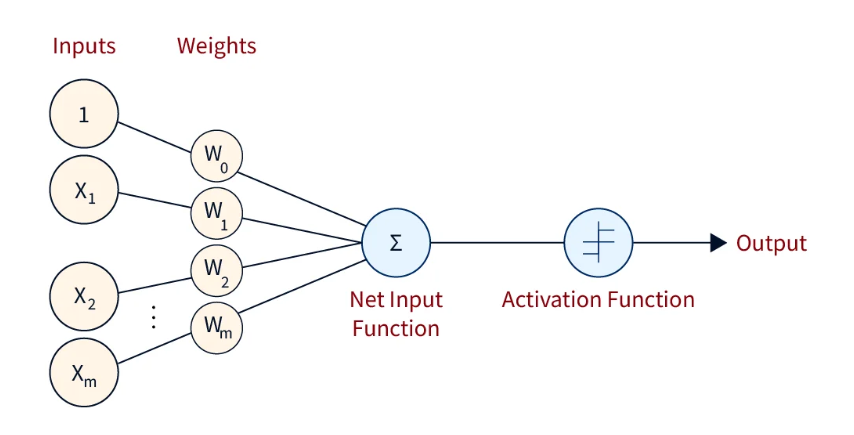
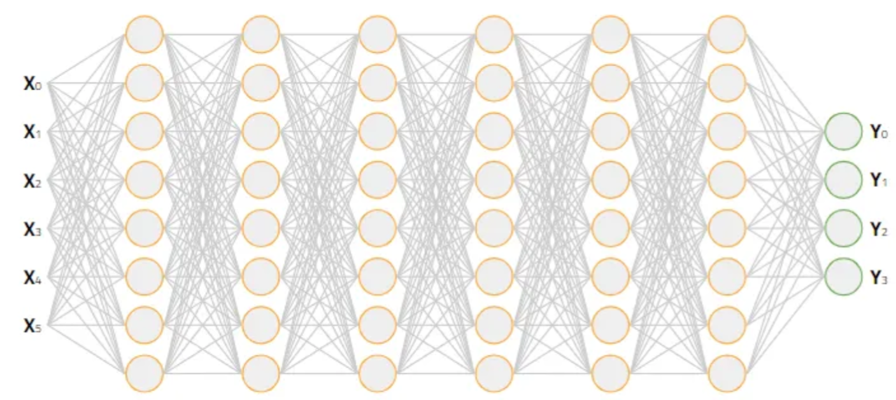

# 神经网络

> Deep learning is a general framework for function approximation.
> 

神经网络是由神经元堆叠而成，单个神经元的公式如下

\\[
 y = \sigma(wx + b) = \sigma(\sum_{i=1}^N (w_i x_i) + b)
\\]

- \\( x \\) 是输入向量，也被叫做输入层，第0层
- \\( \sigma \\) 是激活函数（如 sigmoid, ReLU 等）  
- \\( N \\) 是输入向量的维度
- \\( w, b\\) 是待确定的参数, \\(w\\) 是权重向量，\\(b\\) 是偏执



单层神经网络是由神经元堆叠而成，包含一个隐藏层( \\(l=1\\) )，和一个输出层( \\(l=2\\) )

\\[
 y^2 = w^2y^1 + b^2
\\]

其中 \\(y^1\\) 为隐藏层的输出
\\[
 y_j^1 = \sigma(w_j^1x + b^1)
\\]
- 上标标识第几层

> Neural nets are powerful approximators: any continuous function can be arbitrarily well approximated on a compact using a three-layer fully connected network F = f1 ◦ σ ◦ f2 (universal approximation theorem, Cybenko, 1989, Hornik, 1991).

根据通用逼近定理（Universal Approximation Theorem），
**如果激活函数是非线性且满足某些条件**（如连续、有界、非恒等于零），
那么一个具有足够多的神经网络节点，可以在紧集上逼近任意连续函数
\\(f: \mathbb{R}^n \to \mathbb{R}\\)

单层神经网络可以去拟合任意函数形式，但是前提条件是具有足够多的神经网络节点，可能是无限多，同时未知函数形势是需要连续的（不管这个条件）。但毕竟我们不能构建无限多的神经网络节点，
我们只能从其他方面入手，在有限的资源下（节点个数），获得更好的效果。
其中一个方式就是多层神经网络（这也是**深度学习**中**深度**的含义）。

从单层神经网络的公式中可以看出（在最外层添加一个激活函数），神经网络的定义是一种递归结构，很容易把单层神经网络推广到多层。
\\[
 y^l = \sigma(w^ly^{l-1} + b^l)
\\]

\\[
 y^0 = x
\\]

- \\(1 \in \\{1, 2, ..., n\\} \\)，为层的标识，第几层。
- \\(w^l \\) 是权重矩阵。



我们希望在不改变神经元个数的情况，通过增加神经网络的层数，来获得更好的拟合能力。

为了什么能这样？我们期待的是一种特征的分层提取。

## 训练

训练神经网络，本质上就是要使得所有样本的误差最小（也就是所有样本的输出都很满意，符合实际的情况）。
我们要定义误差函数，注意这是一个关于权重的函数。

\\[
C = f(W, B) = \sum_{i=1}^N (\Arrowvert y_i^L - y_i^{obs} \Arrowvert)
\\]

对于单个样本（误差函数也可以有其他形式）。
\\[
C = f(W, B) =  (\Arrowvert y^L - y^{obs} \Arrowvert) = \sum_{j=1}^J (y_j^L - y_j^{obs})^2
\\]

要求 \\(W, B\\) 使得 \\(C\\) 最小，这是一个高维函数的极值问题，理论上找不到全局最小值，我们只能用梯度下降法去找到一些距地最小值。首选随机给定初始权重\\(W^0, B^0\\)。
然后计算 \\(\nabla C\\) 

\\[ \nabla C_w = \\{\frac{\partial C}{\partial W} \\}\\]
\\[ \nabla C_b = \\{\frac{\partial C}{\partial B} \\}\\]

如何求解梯度？ 

设每个激活函数的输入为
\\[
 z^l = w^ly^{l-1} + b^l
\\]

根据链式求导法则，可以得到

\\[
 \delta^L =  \nabla C_y^L \otimes \sigma'(z^L)
\\]

\\[
 \delta^l =  (w^l)^T \nabla \delta^{l+1} \otimes \sigma'(z^l)
\\]

\\[
 \nabla C_b^l = \delta^l 
\\]

\\[
 \nabla C_w^l = \delta^l {y^{l-1}}^T
\\]
- \\(\sigma'\\) 为激活函数的导数

最后根据梯度更新权重（注意要根据所有样本的来更新权重）。

\\[ W^{t+1} = W^{t} - \eta \frac{1}{n}\sum \nabla C_w  \\]
\\[ B^{t+1} = B^{t} - \eta \frac{1}{n}\sum \nabla C_b  \\]

这就是反向传播算法。


## 激活函数
下面是一些常见激活函数及其导数，这些在反向传播算法中非常关键。

**Sigmoid 函数（Logistic）**
由 sigmoid 神经元构成的网络可以逼近任意函数，sigmoid也是神经网络激活函数的入门款。
\\[
\sigma(x) = \frac{1}{1 + e^{-x}}
\\]

\\[
\sigma'(x) = \sigma(x)(1 - \sigma(x))
\\]
Sigmoid 函数 在 x 比较大或者比较小时，其斜率会非常小，
此时如果误差函数选用的是均方误差（平均绝对误差），
那么会导致梯度下降法的步长变得很小，从而影响拟合的效率。

**Tanh 函数（双曲正切）**
与 sigmoid 函数不同，tanh 的输出范围是 (−1,1)。这种对称性使得在训练中，梯度传播的效果往往更好，尤其是在深层网络中可以减少梯度偏移问题，从而加速收敛。
\\[
\tanh(x) = \frac{e^x - e^{-x}}{e^x + e^{-x}}
\\]

\\[
\tanh'(x) = 1 - \tanh^2(x)
\\]
存在一些理论推理以及实验数据表明，在很多情况下，tanh 神经元的表现优于 sigmoid。

**ReLU（Rectified Linear Unit）**

ReLU 的优点在于它一部分神经元输出为 0，有效地进行选择性激活，相比 sigmoid 和 tanh 无需指数计算，同时梯度不会饱和。极大缓解了**梯度消失（vanishing gradient）**问题，对于多层神经网络的训练很有帮助。
\\[
\mathrm{ReLU}(x) = \max(0, x)
\\]

\\[
\mathrm{ReLU}'(x) = 
\begin{cases}
1, & x > 0 \\
0, & x \le 0
\end{cases}
\\]


**Softplus（ReLU 的平滑版本）**
ReLU存在负半轴的“死亡”问题（dead neuron），一旦某个神经元的输入一直小于 0，它就永远输出 0，永远不更新梯度，彻底失活。用一个平滑过渡，能够一定程度缓解这些问题。

\\[
\mathrm{Softplus}(x) = \ln(1 + e^x)
\\]

\\[
\mathrm{Softplus}'(x) = \frac{1}{1 + e^{-x}} = \sigma(x)
\\]


## 误差函数（代价函数、损失函数）

**均方误差**

\\[
\mathcal{L}_{\mathrm{MSE}} = \frac{1}{n} \sum (y_i - \hat{y}_i)^2
\\]

梯度
\\[
\frac{\partial \mathcal{L}}{\partial \hat{y}_i} = 2(\hat{y}_i - y_i)
\\]


**平均绝对误差**

\\[
\mathcal{L}_{\mathrm{MAE}} = \frac{1}{n} \sum |y_i - \hat{y}_i|
\\]

梯度
\\[
\frac{\partial \mathcal{L}}{\partial \hat{y}_i} = 
\begin{cases}
-1, & \hat{y}_i > y_i \\
1, & \hat{y}_i < y_i \\
\text{undefined}, & \hat{y}_i = y_i
\end{cases}
\\]


**交叉熵**
交叉熵损失函数 感觉是从 负对数似然函数而来。


负对数似然函数的定义

假设我们有一个分类问题，给定输入 \\( x \\)，模型的预测标签 \\( y \\) 的概率分布为 \\( p(y|x, \theta) \\)，其中 \\( \theta \\) 是模型的参数。负对数似然函数定义为：

\\[
\text{NLL} = - \log p(y | x, \theta)
\\]

最大似然估计与交叉熵

假设我们有一个训练数据集 \\( D = \{(x_i, y_i)\}_{i=1}^N \\)，每个样本 \\( x_i \\) 的标签 \\( y_i \\) 从真实分布中独立抽取。

为了使模型的参数 \\( \theta \\) 最优，我们使用最大似然估计（MLE），即通过最大化训练数据集上所有样本的似然函数来找到最优的模型参数。

对于整个数据集的似然函数 \\( L(\theta) \\)，可以表示为：

\\[
L(\theta) = \prod_{i=1}^N p(y_i | x_i, \theta)
\\]

对应的对数似然函数为：

\\[
\log L(\theta) = \sum_{i=1}^N \log p(y_i | x_i, \theta)
\\]

负对数似然函数为：

\\[
\text{NLL} = - \log L(\theta) = - \sum_{i=1}^N \log p(y_i | x_i, \theta)
\\]

与交叉熵的关系

在交叉熵的定义中，考虑每个样本 \\( i \\) 的标签 \\( y_i \\) 和模型预测概率分布 \\( p(\hat{y}|x_i, \theta) \\)。交叉熵损失函数为：

\\[
H(p, \hat{p}) = - \sum_{y} p(y) \log \hat{p}(y)
\\]

在分类任务中，真实标签 \\( y_i \\) 通常是从一个真实分布 \\( p(y) \\) 中抽取的，因此我们可以把交叉熵看作是每个样本的负对数似然。对于每个样本，交叉熵损失为：

\\[
H(p, \hat{p}) = - \log p(y_i | x_i, \theta)
\\]

推导过程

将负对数似然函数和交叉熵联系起来：

1. 对于每个样本 \\( i \\)，负对数似然为 \\( - \log p(y_i | x_i, \theta) \\)，这正是交叉熵的定义。

2. 对整个数据集 \\( D \\)，交叉熵损失（对所有样本的损失平均值）为：

\\[
H(p, \hat{p}) = - \frac{1}{N} \sum_{i=1}^N \log p(y_i | x_i, \theta)
\\]

这与负对数似然函数的形式完全相同，区别在于交叉熵是对所有样本的平均值。

- 负对数似然函数可以看作是交叉熵的一个特例，特别是在分类问题中。
- 在最大似然估计中，我们通过最大化数据集上样本的似然函数来训练模型，而交叉熵可以被看作是负对数似然的平均值。
  
最终我们可以得出结论：**交叉熵是负对数似然函数的平均值**，并且它们在多分类或二分类问题中是等价的。

对于单个样本，交叉熵损失函数的定义为

\\[
 \mathcal{L}_{\mathrm{CE}} = - \sum y_i^{obs} \ln(y_i)
\\]

对于神经网络的输出层，如果套了一层 Softmax，这时用交叉熵损失函数作为误差函数，会使得偏导计算十分方便。

对于Z的求导
\\[
\frac{ \partial \mathcal{L}}{ \partial Z_i^L} = y_i^L - y_i^{obs}
\\]

其中
\\[
 Z_i^L = \sigma(z_i^L)
\\]

交叉熵与Softmax函数结合在一起，也叫 Softmax 损失。

那交叉熵的直观含义是什么呢？我们应该如何理解它？在信息论中对交叉熵有一个标准的解释方式。

粗略地说，交叉熵衡量的是“惊讶”程度。具体而言，我们的神经元试图计算的是函数 \\( f \\)，但实际上它计算的是 \\( \hat{f} \\) 假设我们将 \\( \hat{f} \\) 视为 \\( f \\)的概率估计值，那么交叉熵就衡量了当我们得知 \\( \hat{f} \\) 的真实值时，我们“平均上感到多惊讶”。如果输出结果与我们预期一致，我们的“惊讶”就小；如果结果出乎意料，“惊讶”就大。

## 训练优化策略

几乎所有的机器学习优化算法都是基于梯度下降的算法。

依据计算目标函数梯度使用的数据量的不同，有一种梯度下降的变体，即随机梯度下降（stotastic gradient descent, SGD），每次只用随机的部分的样本用于更新权重。这样可以加快算法的收敛速度（比较不用每次都把全部的样本跑一次）。

另一类优化，是考虑每次走多远。

比如用 Hessian 优化，考虑二阶项，加速误差函数的收敛速度。
\\[\Delta w = -H^{-1} \nabla C \\]
但是求 Hessian 矩阵比较消耗资源。

直观地说，Hessian优化的优势在于它不仅引入了关于梯度的信息，还引入了关于梯度变化的信息。基于动量的梯度下降法基于类似的直觉，但避免了使用大量的二阶导数矩阵。

基于动量的梯度下降法的数学定义需要引入一个速度量，速度量和权重一一对应。
\\[ v' = \mu v - \eta \nabla C  \\]
\\[ w' = w + v'  \\]

对于速度的更新，可以想象单位质量为 1 的小球，在力 \\( \eta \nabla C \\) 的作用下，在单位时间 动量的变化。对 \\( w \\) 的更新，可以想象程单位时间在速度 \\( v' \\) 的作用下发生的位移。如果我们直线下坡会发生什么情况，每一步沿着斜坡向下，速度都会增加，因此我们会越来越快地接近谷底。这种特性使得动量方法相比标准梯度下降法能够更快地收敛。\\( \mu \\) 相当于摩擦系数，可以在加速学习的同时避免“冲过头”的风险。

在现有的梯度下降实现中，几乎无需改动就可以引入动量机制。通过这种方式，我们可以在不引入Hessian巨大计算代价的前提下，部分利用梯度变化的信息，从而获得类似Hessian方法的优势。

最后是如何避免陷入某些不好的距地最小值，而去寻找更好的最小值位置，比如用自适应步长技术来避免局部最小值（Adagrad，RMSProp，Adam），比如 RMSProp 使用二阶矩估计来调整各个参数的学习率，每个参数按其历史梯度动态调整步长，避免大步震荡或小步卡顿。

## 正则化

拥有大量自由参数的模型可以描述极其广泛的现象。即使这样的模型与现有数据吻合得很好，也并不意味着它是一个好的模型。这可能仅仅意味着模型拥有足够的自由度，几乎可以描述任何给定规模的数据集，而无法捕捉到任何对潜在现象的真正洞察。当这种情况发生时，模型虽然适用于现有数据，但无法推广到新的情况。对一个模型的真正考验是它能否在从未接触过的情况下做出预测

检测过拟合最明显的方法是使用上述方法，在网络训练过程中持续追踪测试数据的准确率。如果我们发现测试数据的准确率不再提升，就应该停止训练。

增加训练样本，也可以防止过度拟合，样本的size应当比权重要多吧！

除了以上方法，也可以采用正则化技术，最常用的正则化技术，有时也称为权重衰减或 L2 正则化。L2 正则化的思想是在成本函数中添加一个额外的项，称为正则化项。

\\[ \frac{\lambda}{2n} \sum w^2 \\]

直观地说，正则化的作用是使网络 在其他条件相同的情况下，更喜欢学习较小的权重。换句话说，正则化可以被视为在寻找小权重和最小化原始成本函数。

\\[
 \nabla C_w^l = \delta^l {y^{l-1}}^T + \frac{\lambda}{n}w
\\]

\\[ W^{t+1} = (1-\frac{\eta \lambda}{n})W^{t} - \frac{1}{n}\sum \nabla C_w  \\]

对于 SGD (每次m个样本): 

\\[ W^{t+1} = (1-\frac{\eta \lambda}{n})W^{t} - \frac{1}{m}\sum \nabla C_w  \\]

权重越小，从某种意义上来说复杂度就越低，因此能够更简单、更有力地解释数据，因此应该优先考虑。有一种观点认为，在科学上我们应该遵循 更简单的解释，除非被迫不这样做。权重较小意味着，即使我们随意更改一些随机输入，网络的行为也不会发生太大变化。

dropout 是一种类似集合平均的正则化技术，但是是网络内部的集合平均。

人为地扩大训练数据（样本需要具备，平移，旋转等对称性）。

## 权重初始化

减低权重的标准差，避免激活函数的输入，由于卷积的影响，变成很偏坦的高斯分布，从而导致隐藏层达到饱和，难以训练。


## 案例代码
``` python

"""

An improved version of network.py, implementing the stochastic
gradient descent learning algorithm for a feedforward neural network.
Improvements include the addition of the cross-entropy cost function,
regularization, and better initialization of network weights.  Note
that I have focused on making the code simple, easily readable, and
easily modifiable.  It is not optimized, and omits many desirable
features.

"""

#### Libraries
# Standard library
import json
import random
import sys

# Third-party libraries
import numpy as np


#### Define the quadratic and cross-entropy cost functions

class QuadraticCost(object):

    @staticmethod
    def fn(a, y):
        """Return the cost associated with an output ``a`` and desired output
        ``y``.

        """
        return 0.5*np.linalg.norm(a-y)**2

    @staticmethod
    def delta(z, a, y):
        """Return the error delta from the output layer."""
        return (a-y) * sigmoid_prime(z)


class CrossEntropyCost(object):

    @staticmethod
    def fn(a, y):
        """Return the cost associated with an output ``a`` and desired output
        ``y``.  Note that np.nan_to_num is used to ensure numerical
        stability.  In particular, if both ``a`` and ``y`` have a 1.0
        in the same slot, then the expression (1-y)*np.log(1-a)
        returns nan.  The np.nan_to_num ensures that that is converted
        to the correct value (0.0).

        """
        return np.sum(np.nan_to_num(-y*np.log(a)-(1-y)*np.log(1-a)))

    @staticmethod
    def delta(z, a, y):
        """Return the error delta from the output layer.  Note that the
        parameter ``z`` is not used by the method.  It is included in
        the method's parameters in order to make the interface
        consistent with the delta method for other cost classes.

        """
        return (a-y)


#### Main Network class
class Network(object):

    def __init__(self, sizes, cost=CrossEntropyCost):
        """The list ``sizes`` contains the number of neurons in the respective
        layers of the network.  For example, if the list was [2, 3, 1]
        then it would be a three-layer network, with the first layer
        containing 2 neurons, the second layer 3 neurons, and the
        third layer 1 neuron.  The biases and weights for the network
        are initialized randomly, using
        ``self.default_weight_initializer`` (see docstring for that
        method).

        """
        self.num_layers = len(sizes)
        self.sizes = sizes
        self.default_weight_initializer()
        self.cost=cost

    def default_weight_initializer(self):
        """Initialize each weight using a Gaussian distribution with mean 0
        and standard deviation 1 over the square root of the number of
        weights connecting to the same neuron.  Initialize the biases
        using a Gaussian distribution with mean 0 and standard
        deviation 1.

        Note that the first layer is assumed to be an input layer, and
        by convention we won't set any biases for those neurons, since
        biases are only ever used in computing the outputs from later
        layers.

        """
        self.biases = [np.random.randn(y, 1) for y in self.sizes[1:]]
        self.weights = [np.random.randn(y, x)/np.sqrt(x)
                        for x, y in zip(self.sizes[:-1], self.sizes[1:])]

    def large_weight_initializer(self):
        """Initialize the weights using a Gaussian distribution with mean 0
        and standard deviation 1.  Initialize the biases using a
        Gaussian distribution with mean 0 and standard deviation 1.

        Note that the first layer is assumed to be an input layer, and
        by convention we won't set any biases for those neurons, since
        biases are only ever used in computing the outputs from later
        layers.

        This weight and bias initializer uses the same approach as in
        Chapter 1, and is included for purposes of comparison.  It
        will usually be better to use the default weight initializer
        instead.

        """
        self.biases = [np.random.randn(y, 1) for y in self.sizes[1:]]
        self.weights = [np.random.randn(y, x)
                        for x, y in zip(self.sizes[:-1], self.sizes[1:])]

    def feedforward(self, a):
        """Return the output of the network if ``a`` is input."""
        for b, w in zip(self.biases, self.weights):
            a = sigmoid(np.dot(w, a)+b)
        return a

    def SGD(self, training_data, epochs, mini_batch_size, eta,
            lmbda = 0.0,
            evaluation_data=None,
            monitor_evaluation_cost=False,
            monitor_evaluation_accuracy=False,
            monitor_training_cost=False,
            monitor_training_accuracy=False):
        """Train the neural network using mini-batch stochastic gradient
        descent.  The ``training_data`` is a list of tuples ``(x, y)``
        representing the training inputs and the desired outputs.  The
        other non-optional parameters are self-explanatory, as is the
        regularization parameter ``lmbda``.  The method also accepts
        ``evaluation_data``, usually either the validation or test
        data.  We can monitor the cost and accuracy on either the
        evaluation data or the training data, by setting the
        appropriate flags.  The method returns a tuple containing four
        lists: the (per-epoch) costs on the evaluation data, the
        accuracies on the evaluation data, the costs on the training
        data, and the accuracies on the training data.  All values are
        evaluated at the end of each training epoch.  So, for example,
        if we train for 30 epochs, then the first element of the tuple
        will be a 30-element list containing the cost on the
        evaluation data at the end of each epoch. Note that the lists
        are empty if the corresponding flag is not set.

        """
        if evaluation_data: n_data = len(evaluation_data)
        n = len(training_data)
        evaluation_cost, evaluation_accuracy = [], []
        training_cost, training_accuracy = [], []
        for j in xrange(epochs):
            random.shuffle(training_data)
            mini_batches = [
                training_data[k:k+mini_batch_size]
                for k in xrange(0, n, mini_batch_size)]
            for mini_batch in mini_batches:
                self.update_mini_batch(
                    mini_batch, eta, lmbda, len(training_data))
            print "Epoch %s training complete" % j
            if monitor_training_cost:
                cost = self.total_cost(training_data, lmbda)
                training_cost.append(cost)
                print "Cost on training data: {}".format(cost)
            if monitor_training_accuracy:
                accuracy = self.accuracy(training_data, convert=True)
                training_accuracy.append(accuracy)
                print "Accuracy on training data: {} / {}".format(
                    accuracy, n)
            if monitor_evaluation_cost:
                cost = self.total_cost(evaluation_data, lmbda, convert=True)
                evaluation_cost.append(cost)
                print "Cost on evaluation data: {}".format(cost)
            if monitor_evaluation_accuracy:
                accuracy = self.accuracy(evaluation_data)
                evaluation_accuracy.append(accuracy)
                print "Accuracy on evaluation data: {} / {}".format(
                    self.accuracy(evaluation_data), n_data)
            print
        return evaluation_cost, evaluation_accuracy, \
            training_cost, training_accuracy

    def update_mini_batch(self, mini_batch, eta, lmbda, n):
        """Update the network's weights and biases by applying gradient
        descent using backpropagation to a single mini batch.  The
        ``mini_batch`` is a list of tuples ``(x, y)``, ``eta`` is the
        learning rate, ``lmbda`` is the regularization parameter, and
        ``n`` is the total size of the training data set.

        """
        nabla_b = [np.zeros(b.shape) for b in self.biases]
        nabla_w = [np.zeros(w.shape) for w in self.weights]
        for x, y in mini_batch:
            delta_nabla_b, delta_nabla_w = self.backprop(x, y)
            nabla_b = [nb+dnb for nb, dnb in zip(nabla_b, delta_nabla_b)]
            nabla_w = [nw+dnw for nw, dnw in zip(nabla_w, delta_nabla_w)]
        self.weights = [(1-eta*(lmbda/n))*w-(eta/len(mini_batch))*nw
                        for w, nw in zip(self.weights, nabla_w)]
        self.biases = [b-(eta/len(mini_batch))*nb
                       for b, nb in zip(self.biases, nabla_b)]

    def backprop(self, x, y):
        """Return a tuple ``(nabla_b, nabla_w)`` representing the
        gradient for the cost function C_x.  ``nabla_b`` and
        ``nabla_w`` are layer-by-layer lists of numpy arrays, similar
        to ``self.biases`` and ``self.weights``."""
        nabla_b = [np.zeros(b.shape) for b in self.biases]
        nabla_w = [np.zeros(w.shape) for w in self.weights]
        # feedforward
        activation = x
        activations = [x] # list to store all the activations, layer by layer
        zs = [] # list to store all the z vectors, layer by layer
        for b, w in zip(self.biases, self.weights):
            z = np.dot(w, activation)+b
            zs.append(z)
            activation = sigmoid(z)
            activations.append(activation)
        # backward pass
        delta = (self.cost).delta(zs[-1], activations[-1], y)
        nabla_b[-1] = delta
        nabla_w[-1] = np.dot(delta, activations[-2].transpose())
        # Note that the variable l in the loop below is used a little
        # differently to the notation in Chapter 2 of the book.  Here,
        # l = 1 means the last layer of neurons, l = 2 is the
        # second-last layer, and so on.  It's a renumbering of the
        # scheme in the book, used here to take advantage of the fact
        # that Python can use negative indices in lists.
        for l in xrange(2, self.num_layers):
            z = zs[-l]
            sp = sigmoid_prime(z)
            delta = np.dot(self.weights[-l+1].transpose(), delta) * sp
            nabla_b[-l] = delta
            nabla_w[-l] = np.dot(delta, activations[-l-1].transpose())
        return (nabla_b, nabla_w)

    def accuracy(self, data, convert=False):
        """Return the number of inputs in ``data`` for which the neural
        network outputs the correct result. The neural network's
        output is assumed to be the index of whichever neuron in the
        final layer has the highest activation.

        The flag ``convert`` should be set to False if the data set is
        validation or test data (the usual case), and to True if the
        data set is the training data. The need for this flag arises
        due to differences in the way the results ``y`` are
        represented in the different data sets.  In particular, it
        flags whether we need to convert between the different
        representations.  It may seem strange to use different
        representations for the different data sets.  Why not use the
        same representation for all three data sets?  It's done for
        efficiency reasons -- the program usually evaluates the cost
        on the training data and the accuracy on other data sets.
        These are different types of computations, and using different
        representations speeds things up.  More details on the
        representations can be found in
        mnist_loader.load_data_wrapper.

        """
        if convert:
            results = [(np.argmax(self.feedforward(x)), np.argmax(y))
                       for (x, y) in data]
        else:
            results = [(np.argmax(self.feedforward(x)), y)
                        for (x, y) in data]
        return sum(int(x == y) for (x, y) in results)

    def total_cost(self, data, lmbda, convert=False):
        """Return the total cost for the data set ``data``.  The flag
        ``convert`` should be set to False if the data set is the
        training data (the usual case), and to True if the data set is
        the validation or test data.  See comments on the similar (but
        reversed) convention for the ``accuracy`` method, above.
        """
        cost = 0.0
        for x, y in data:
            a = self.feedforward(x)
            if convert: y = vectorized_result(y)
            cost += self.cost.fn(a, y)/len(data)
        cost += 0.5*(lmbda/len(data))*sum(
            np.linalg.norm(w)**2 for w in self.weights)
        return cost

    def save(self, filename):
        """Save the neural network to the file ``filename``."""
        data = {"sizes": self.sizes,
                "weights": [w.tolist() for w in self.weights],
                "biases": [b.tolist() for b in self.biases],
                "cost": str(self.cost.__name__)}
        f = open(filename, "w")
        json.dump(data, f)
        f.close()

#### Loading a Network
def load(filename):
    """Load a neural network from the file ``filename``.  Returns an
    instance of Network.

    """
    f = open(filename, "r")
    data = json.load(f)
    f.close()
    cost = getattr(sys.modules[__name__], data["cost"])
    net = Network(data["sizes"], cost=cost)
    net.weights = [np.array(w) for w in data["weights"]]
    net.biases = [np.array(b) for b in data["biases"]]
    return net

#### Miscellaneous functions
def vectorized_result(j):
    """Return a 10-dimensional unit vector with a 1.0 in the j'th position
    and zeroes elsewhere.  This is used to convert a digit (0...9)
    into a corresponding desired output from the neural network.

    """
    e = np.zeros((10, 1))
    e[j] = 1.0
    return e

def sigmoid(z):
    """The sigmoid function."""
    return 1.0/(1.0+np.exp(-z))

def sigmoid_prime(z):
    """Derivative of the sigmoid function."""
    return sigmoid(z)*(1-sigmoid(z))
```
