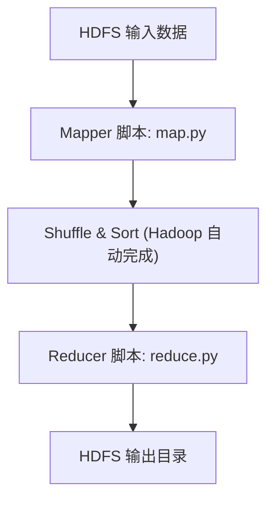

# hadoop

Apache Hadoop 是大数据技术的一种实现方式。Hadoop 是一个框架，允许使用简单的编程模型跨计算机集群对大型数据集进行分布式处理。最小 Hadoop 集群包含三个组件，分别为 作为分布式存储的 Hadoop 分布式文件系统 (HDFS)、用于调度和管理集群的 Hadoop YARN 以及作为执行引擎进行并行处理的 Hadoop MapReduce。

## HDFS
HDFS 是一个文件系统，其命令行操作类似FTP。

### 命令行

| 操作分类 | 命令格式 | 示例 | 说明 |
|----------------|----------|------|------|
| 目录操作 | `hdfs dfs -ls /路径`         | `hdfs dfs -ls /user/hive`        | 查看 HDFS 路径下的文件 |
|         | `hdfs dfs -mkdir /路径`      | `hdfs dfs -mkdir /user/test`      | 创建 HDFS 目录 |
|         | `hdfs dfs -mkdir -p /a/b/c`  | `hdfs dfs -mkdir -p /data/input`  | 递归创建目录 |
|         | `hdfs dfs -rm -r /路径`      | `hdfs dfs -rm -r /data/old`       | 递归删除目录或文件 |
|         | `hdfs dfs -rmdir /路径`      | `hdfs dfs -rmdir /user/empty_dir` | 删除空目录 |
|         | `hdfs dfs -mv 源 目标`       | `hdfs dfs -mv /a.txt /backup/a.txt` | 移动/重命名 |
| 文件操作 | `hdfs dfs -put 本地 HDFS`    | `hdfs dfs -put a.csv /data/`      | 上传文件到 HDFS |
|         | `hdfs dfs -get HDFS 本地`    | `hdfs dfs -get /data/b.txt ./`    | 下载文件 |
|         | `hdfs dfs -cat /文件`  | `hdfs dfs -cat /data/file.txt`          | 查看文件内容 |
|         | `hdfs dfs -tail /文件`       | `hdfs dfs -tail /logs/job.log`    | 查看文件尾部 |
|         | `hdfs dfs -text /文件`       | `hdfs dfs -text /data/file.orc`   | 查看 ORC 等二进制文件 |
|         | `hdfs dfs -du -h /路径`      | `hdfs dfs -du -h /user/hive/warehouse` | 查看文件/目录大小 |
|         | `hdfs dfs -chmod 755 /路径`  | `hdfs dfs -chmod 755 /user/test`  | 修改权限 |
|         | `hdfs dfs -chown 用户:组 /路径` | `hdfs dfs -chown hive:hadoop /data/` | 修改属主 |
| 空间统计 | `hdfs dfs -df -h`            | `hdfs dfs -df -h`               | 查看 HDFS 空间使用情况 |
| 其他    | `hdfs dfsadmin -report`      | `hdfs dfsadmin -report`     | 查看 HDFS 集群状态 |

---

### HDFS 接口

HDFS 提供了一套 RESTful 风格的 HTTP 接口，称为 WebHDFS，
允许用户通过 HTTP 协议对 HDFS 中的数据进行操作，方便跨语言、跨平台集成调用。

``` bash 
# 创建空文件
PUT http://namenode:9870/webhdfs/v1/user/hadoop/test.txt?op=CREATE 

# 上传文件 [Content-Type: application/octet-stream]
PUT http://<datanode>:9870/webhdfs/v1/user/hadoop/test.txt?op=CREATE&data=true 

# 读取文件
GET http://namenode:9870/webhdfs/v1/user/hadoop/test.txt?op=OPEN

# 获取文件状态
GET http://namenode:9870/webhdfs/v1/user/hadoop/test.txt?op=GETFILESTATUS
```

## MapReduce 
Hadoop Streaming 是 Hadoop 提供的一个通用接口，允许用标准输入输出格式写 Mapper 和 Reducer。

用 python 实现 MapReduce，可以理解为 LINUX 的管道。



可以在不启动 Hadoop 的情况下，使用`sort`进行测试
``` bash
chmod +x map.py reduce.py
cat data.txt | python map.py | sort | python reduce.py
```

词频统计 `map.py`

``` bash
#!/usr/bin/env python3
import sys

for line in sys.stdin:
    for word in line.strip().split():
        print(f"{word},1")
```
词频统计 `reduce.py`
``` python
#!/usr/bin/env python3
import sys

current_word = None
count = 0

for line in sys.stdin:
    word, val = line.strip().split(',')
    val = int(val)

    if word == current_word:
        count += val
    else:
        if current_word:
            print(f"{current_word}, {count}")
        current_word = word
        count = val

if current_word:
    print(f"{current_word}, {count}")
```

提交 
``` bash
yarn jar /opt/hadoop/share/hadoop/tools/lib/hadoop-streaming-*.jar \
  -input /input/data.txt \
  -output /output/wordcount \
  -mapper map.py \
  -reducer reduce.py \
  -file map.py \
  -file reduce.py
```

## yarn

yarn 是一个任务调度器，类似 HPC 中的 slurm。
yarn 支持 Web UI，上手能能快一些。

**查看集群状态的一些命令**
```
yarn node -list
yarn clust --help
```

**任务相关**
``` bash
yarn jar hadoop-mapreduce-examples-3.4.1.jar pi 10 15 # 提交一个任务
yarn application -list # 查看任务小黄太
yarn application -kill <ApplicationId> # 杀死任务
```

## 通过 yarn 提交 spark 应用
```
spark-submit \
  --master yarn \
  --deploy-mode cluster \
  wordcount.py \
  hdfs:///input.txt \
  hdfs:///output/
```
